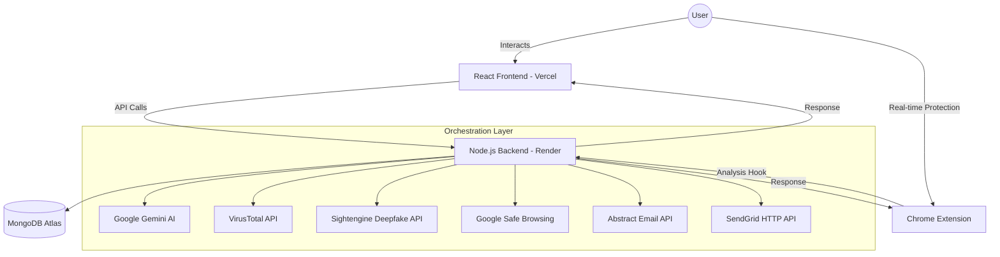

# NoFraud: Universal Threat Intelligence Hub 🛡️

**A Finalist Project for IndiaNext Hackathon by Team VAAS**

[](https://nofraud.vercel.app)
[](https://nofraud-backend.onrender.com)
[]()

---

## 🚫 The Problem
Digital fraud is no longer just "spam." It has evolved into a multi-vector attack surface involving **polymorphic phishing, malicious file attachments, social engineering, and AI-generated deepfakes.** Most users are overwhelmed by the technical complexity required to distinguish a legitimate message from a high-stakes fraud attempt.

## ✨ The Solution
**NoFraud** is a comprehensive, centralized ecosystem designed to democratize cybersecurity. We provide a single interface where users can analyze *any* suspicious digital artifact—be it a link, a file, a video, or an email—and receive an instant, AI-driven verdict.

---

## 🚀 Key Features

### 🌐 Centralized Analysis Hub
Analyze any digital artifact in a unified interface:
- **URL Scanner**: Real-time reputation checks against global blacklists.
- **File Analyzer**: Automated malware detection and signature analysis.
- **Email Intelligence**: Deep scanning of email metadata and body content.
- **Deepfake Detector**: Advanced AI analysis to detect manipulated media and AI-generated content.

### 🤖 AI-Powered Verdict Engine
- **Semantic Analysis**: Uses Google Gemini to detect psychological manipulation (urgency, impersonation) that traditional scanners miss.
- **Actionable Advice**: Every scan provides a "Why this is fraud" explanation and a step-by-step "What to do next" guide.
- **Security Scoring**: Dynamically calculates a user's risk profile based on recent activity.

### 📊 Intelligence Reporting
- **PDF Report Generation**: Professional, in-depth security reports featuring data visualization (Charts/Pie charts) of threats identified over the last 15 days.
- **Security Scorecards**: Visual performance tracking of your digital safety.

### 🧩 Chrome Extension (Real-time Protection)
- **Real-time Threat Detection**: Automatically identifies suspicious links while browsing.
- **Ad & Tracker Blocker**: Enhanced privacy protection built into the browser.
- **Mail Scanner Integration**: Scans emails directly within the Gmail interface.
- **Privacy Guard**: Monitors site permissions and blocks intrusive trackers.

---

## 🛠️ Technical Architecture



---

## 💻 Tech Stack

- **Frontend**: React.js, Vite, Tailwind CSS (Neumorphic Design System), jsPDF, Chart.js.
- **Backend**: Node.js, Express.js, MongoDB (Mongoose), JWT Auth.
- **AI/Security APIs**: 
    - **Google Gemini**: Psychological & semantic analysis.
    - **Sightengine**: AI-media & deepfake detection.
    - **VirusTotal**: Malicious file & URL signatures.
    - **Abstract API**: Email fraud & deliverability verification.
    - **Google Safe Browsing**: Global reputation checks.
- **DevOps**: Vercel (Frontend), Render (Backend), GitHub Actions.

---

## 🎨 Design Philosophy: Premium Neumorphism
The UI/UX is built on a **Light Neumorphic Design System**. Unlike traditional "flat" security tools, NoFraud feels tactile, modern, and high-end. This approach transforms a "technical security chore" into a premium interaction, making protection feel secondary to a great user experience.

---

## 🛠️ Installation & Setup

### Prerequisites
- Node.js (v18+)
- MongoDB Atlas Account
- API Keys for Gemini, VirusTotal, Sightengine, etc.

### Backend Setup
```bash
cd backend
npm install
# Create a .env file with your credentials
npm start
```

### Frontend Setup
```bash
cd frontend
npm install
# Set VITE_API_URL in .env
npm run dev
```

### Extension Setup
1. Open Chrome and go to `chrome://extensions/`.
2. Enable "Developer mode."
3. Click "Load unpacked" and select the `Extension` folder.

---

## 👥 Meet Team VAAS
**Project for IndiaNext Hackathon** 🇮🇳
- **Vision**: To make the internet safe for everyone, one scan at a time.
- **Goal**: Scaling NoFraud into a 360-degree digital life insurance for the modern web.

---

© 2026 Team VAAS | All Rights Reserved.
