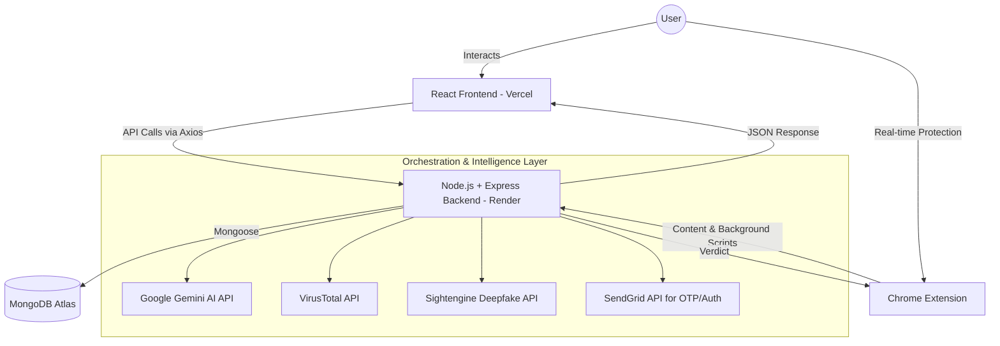

<div align="center">

# 🛡️ NoFraud: Universal Threat Intelligence Hub

**A Finalist Project for IndiaNext 24hr Hackathon by Team VAAS** 🇮🇳
*(Organized at Kandivli Education Society's BK Shroff College Of Arts and MH Shroff College Of Commerce)*

[](https://no-fraud.vercel.app/)
[](https://nofraud-backend.onrender.com)
[]()

<br/>

*Design and develop a smart cyber defense platform that can detect, analyze, and explain emerging cyber threats using AI/ML techniques.*

</div>

---

## 💻 Tech Stack

<div align="center">
  <br/>
  
  ### Frontend
  
  
  
  
  ### Backend
  
  
  
  
  ### APIs & Intelligence
  
  
  
  

  ### Extension & DevOps
  
  
  

  <br/>
</div>

---

## 🏆 The IndiaNext Hackathon Journey
From **226 registrations**, the top **100 teams** were selected for the on-campus 24-hour hackathon. The event was split into two tracks: *Idea Sprint* and *Brainstorm*. 
Team VAAS competed in the highly competitive **Brainstorm track** alongside 70 other teams. Surviving a rigorous mid-hackathon elimination round that cut out 30 teams, we successfully advanced to the **Final Round**, presenting our comprehensive cyber-defense solution. 

---

## 🚫 The Problem
Digital fraud is no longer just "spam." It has evolved into a multi-vector attack surface involving **polymorphic phishing, malicious file attachments, social engineering, and AI-generated deepfakes.** Most users are overwhelmed by the technical complexity required to distinguish a legitimate message from a high-stakes fraud attempt.

## ✨ The Solution
**NoFraud** is a comprehensive, centralized ecosystem designed to democratize cybersecurity. We provide a single interface where users can analyze *any* suspicious digital artifact—be it a link, a file, a video, or an email—and receive an instant, AI-driven verdict.

---

## 🚀 Key Features

### 🌐 Centralized Analysis Hub (Web App)
Analyze any digital artifact in a unified, beautiful interface:
- 🔗 **URL Scanner**: Real-time reputation checks.
- 📁 **File Analyzer**: Automated malware detection and signature analysis.
- 🎥 **Deepfake Detector**: Advanced AI analysis to detect manipulated media and AI-generated content.
- 💬 **Threat Explanation Chat**: Contextual, GenAI-powered explanations of *why* the threat is dangerous.

### 🤖 AI-Powered Verdict Engine
- 🧠 **Semantic Analysis**: Uses Google Gemini to detect psychological manipulation (urgency, impersonation) that traditional scanners miss.
- 🛡️ **Actionable Advice**: Every scan provides a "Why this is fraud" explanation and a step-by-step "What to do next" guide.
- 📊 **Security Reporting**: Downloadable PDF security reports featuring data visualization for threats identified over the last 15 days.

### 🧩 Chrome Extension (Active Protection)
- 🚨 **Real-time Threat Detection**: Automatically identifies suspicious links while browsing.
- 🛑 **Privacy Guard & Ad Blocker**: Enhanced privacy protection built into your browser, blocking invasive trackers.
- 🔗 **Context Scripting Integration**: Directly ties browsing context into the NoFraud backend verdict engine.
- 🔐 **Customizable Security PIN**: Lock specific extension features with a master PIN.

---

## 🛠️ Technical Architecture

The platform operates on a robust MERN-stack architecture enriched with multiple 3rd-party security and AI APIs:



---

## 🎨 Design Philosophy: Premium Neumorphism
The UI/UX is built on a **Light Neumorphic Design System** (Soft UI). Unlike traditional "flat" security tools, NoFraud uses calculated shadows, highlights, and subtle gradients to feel tactile, modern, and high-end. This approach transforms a stressful "technical security chore" into an engaging, premium interaction.

---

## 🛠️ Installation & Setup

### Prerequisites
- Node.js (v18+)
- MongoDB Atlas Account / Local URI
- API Keys for Gemini, VirusTotal, Sightengine, SendGrid

### Backend Setup
```bash
cd backend
npm install
# Create a .env file with your credentials (see .env config logic)
npm start
```

### Frontend Setup
```bash
cd frontend
npm install
# Set VITE_API_URL in .env (e.g., http://localhost:3010/api)
npm run dev
```

### Chrome Extension Setup
1. Open Chrome and navigate to `chrome://extensions/`.
2. Enable **"Developer mode"** in the top right corner.
3. Click **"Load unpacked"** and select the `Extension` folder from the repository.

---

## 👥 Meet Team VAAS

<table>
  <tr>
    <td align="center"><a href="https://github.com/UsaaryanByte07"><br /><sub><b>Aryan Upadhyay</b></sub></a><br />Backend Dev & Leader</td>
    <td align="center"><a href="https://github.com/VarunQuantDev"><br /><sub><b>Varun Mange</b></sub></a><br />Frontend Developer</td>
    <td align="center"><a href="https://github.com/BitSplice-pix"><br /><sub><b>Salman Ansari</b></sub></a><br />Chrome Extension Dev</td>
    <td align="center"><a href="https://github.com/SalviAjinkya"><br /><sub><b>Ajinkya Salvi</b></sub></a><br />Chrome Extension Dev</td>
  </tr>
</table>

<div align="center">
  <i>Our Vision: To make the internet safe for everyone, one scan at a time.</i>
  <br/><br/>
  © 2026 Team VAAS | All Rights Reserved.
</div>

